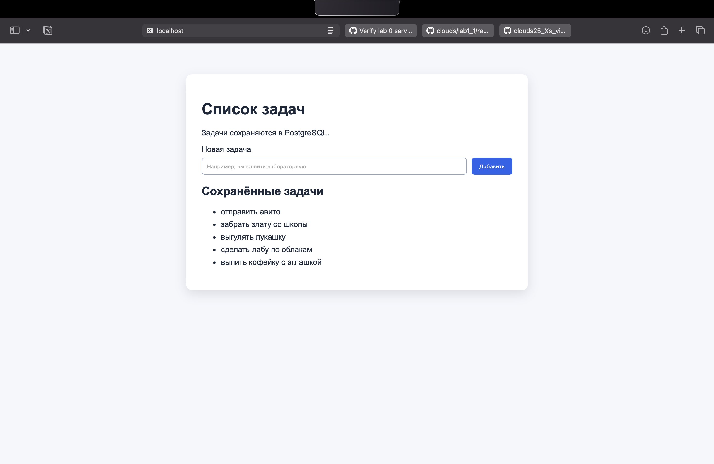

# Лабораторная работа 0

Репозиторий со всей работой: <https://github.com/Sofa-maruysh/cloud-labs>. Сама лаба лежит в папке `lab-0`.

## Шаг 1. Что вообще нужно было сделать

Нужно было сделать маленький сервис, который потом пригодится в следующих лабах. Но не просто страничку, а штуку из трёх частей: фронт, бэк и нормальная база данных. SQLite тут не подходит, потому что база должна жить отдельно и к ней нужно обращаться по сети.

Я решила сделать список задач. Это самый понятный вариант: добавила задачу, обновила страницу, задача осталась — значит, она действительно дошла до базы, а не просто красиво появилась на экране.

## Шаг 2. Из чего состоит моя штука

1. Фронтенд — страница со строкой ввода, кнопкой «Добавить» и списком задач.
2. Бэкенд — Flask. Он получает текст задачи, кладёт его в базу и потом достаёт все задачи обратно.
3. База — PostgreSQL. Она запускается отдельным контейнером Docker, а не лежит файликом где-то внутри программы.

Если совсем по-простому: браузер пишет Flask, Flask пишет PostgreSQL, потом PostgreSQL отдаёт задачи Flask, а Flask показывает их на странице.

## Шаг 3. Docker и запуск

Для запуска поставила Docker Desktop. Он нужен, чтобы поднять отдельно приложение и отдельно PostgreSQL, а не пытаться руками ставить и настраивать базу.

Дальше в папке `lab-0` выполнила:

```bash
docker compose up --build
```

Команда собирает приложение и запускает два контейнера:

- `app` — Flask-приложение;
- `db` — PostgreSQL.

Сначала хотела открыть всё на порту `5000`, но оказалось, что он уже занят. Поменяла внешний порт на `5050`, и в браузере открыла <http://localhost:5050>.

Полная инструкция на случай, если я потом забуду команды, лежит в [README.md](README.md).

## Шаг 4. Проверка, что это не обманка

Добавила в список несколько обычных задач: отправить авито, забрать Злату со школы, выгулять Лукашку, сделать лабу по облакам и выпить кофейку с Аглашкой.

Потом обновила страницу. Список остался. Значит, задачи сохраняются в PostgreSQL, а не исчезают после перезагрузки, как было бы, если бы я хранила их просто внутри страницы.



## Что в итоге

У меня есть маленький сервис, который реально запускается локально. В нём есть фронт, бэк и отдельная база. Честно говоря, больше всего пришлось повозиться не со списком задач, а с Docker и свободным портом, но в итоге всё поднялось и работает.
